# i-dunno

Spec-driven TDD workflow for Claude Code. Idea goes in, working reviewed documented code comes out.

## Skills

| Skill | Role |
|---|---|
| `/define` | Entry point. Guides idea through brainstorm → spec → design, then hands off to `/implement`. |
| `/implement` | TDD loop. Reads spec, researches prior art, writes failing tests, implements until they pass. Hands off to `/review`. |
| `/review` | Deep code-quality and design-pattern audit (SOLID, coupling, abstraction level, duplication, security, dead code). Hands off to `/validate`. |
| `/validate` | Spec-compliance check (ACs, intent, edge cases, architecture, UI, integration), then wraps up. |
| `/gc` | Maintenance. Prunes stale, duplicate, out-of-scope, and unverifiable entries from `CLAUDE.md` and `docs/` files. |

## Workflow

```mermaid
flowchart TD
    A([User + idea]) --> B[define: ask up to 3 questions]
    B --> C[define: write Brainstorm section]
    C --> D{approve?}
    D -- changes --> C
    D -- yes --> E[define: write Story + ACs]
    E --> F{approve?}
    F -- changes --> E
    F -- yes --> G[define: write Design + Modules]
    G --> H{approve?}
    H -- changes --> G
    H -- yes --> I([Run /implement spec-path])
    I --> J[Detect framework]
    J --> K{detected?}
    K -- no --> L([ask user])
    K -- yes --> M[Research prior art in specs + codebase]
    M --> N[Write failing tests]
    N --> O[Write implementation]
    O --> P{tests pass?}
    P -- no, up to 5 --> O
    P -- yes --> Q([Run /review spec-path])
    Q --> Q2[Audit: SOLID, coupling, abstraction, duplication, security, dead code]
    Q2 --> R{issues?}
    R -- fix + retry, up to 3 --> Q2
    R -- clean --> S([Run /validate spec-path])
    S --> S2[Check ACs, intent, edge cases, architecture, UI, integration]
    S2 --> S3{gaps?}
    S3 -- fix + retry, up to 3 --> S2
    S3 -- clean --> T[Append file refs + Summary to spec]
    T --> U[Update docs/MEMORY.md]
    U --> V[Mark spec: implemented]
    V --> W([Done])
```



## Hooks

| Hook | Trigger | Blocks |
|---|---|---|
| `file-guard.sh` | Write / Edit | `.env`, key files, `bin/` writes, out-of-root paths, secret patterns in content |
| `bash-guard.sh` | Bash | `rm -rf`, force push, pipe-to-shell, shell reads of key files |
| `commit-guard.sh` | Bash | non-Conventional-Commits commit messages |
| `post-edit-tests.sh` | Write / Edit (post) | nothing — runs the test suite after each source-file change |

## Structure

```
hooks/
  hooks.json        — plugin hook registration (loaded when installed as a plugin)
  *.sh              — guard/test scripts, referenced via ${CLAUDE_PLUGIN_ROOT}
docs/
  specs/            — feature specs (status-tracked, workflow-owned)
  MEMORY.md         — decision rationales: why X over Y, never file paths or patterns
  architecture.md   — system-wide structural decisions (hand-maintained, optional)
  design-system.md  — colors, tokens, UI rules (hand-maintained, optional)
```

`CLAUDE.md` — tech stack, folder purposes, and iron-law rules only. Everything else goes in `docs/`.
